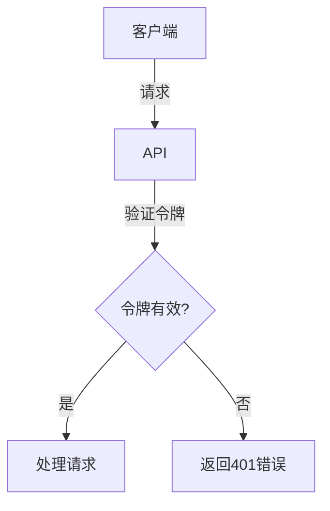

# Markdown 结构化输出模板 (Markdown Output Template)

用于生成格式化的、有明确结构的markdown内容，包含章节、内容和可视元素。

## Template Structure

```
## 输出整体结构 (Overall Structure)
[Define all major sections and their purposes]

## 格式化规则 (Formatting Rules)
[Specific markdown syntax and conventions to follow]

## 部分定义 (Section Definitions)
[Detailed description of each section type]

## 视觉元素 (Visual Elements)
[Icons, symbols, code blocks, diagrams]

## 内容准则 (Content Guidelines)
[Tone, length, style, specific requirements]

## 示例输出 (Example Output)
[Complete example showing desired structure]

## 质量检查清单 (Quality Checklist)
[Validation points before finalizing]
```

## Complete Example: API Documentation

```
## 输出整体结构

生成的文档应包含以下主结构：

1. **标题和概述** - 什么是这个API，用途是什么
2. **快速入门** - 最快上手的步骤（<5分钟）
3. **基本概念** - 理解API必须知道的核心概念
4. **API端点** - 每个endpoint的详细文档
5. **认证** - 安全和认证机制
6. **错误处理** - 错误代码和处理建议
7. **代码示例** - 完整的工作示例
8. **常见问题** - 常见问题和解决方案
9. **最佳实践** - 推荐的使用方式

## 格式化规则

### 标题层级 (Header Hierarchy)
- # 用于文档标题（仅1个）
- ## 用于主章节（快速入门、API端点等）
- ### 用于子章节（endpoint分类、特定方法）
- #### 用于详细项目（参数、返回值）

### 强调和重要信息
```markdown
**粗体** - 关键术语、重要参数
*斜体* - 说明或次要信息  
`代码` - 变量、参数名、小代码片段
***粗斜体*** - 特别强调（谨慎使用）
> 引用块 - 重要提示、警告、注意事项
```

### 列表规则
- **无序列表** (-) 用于特性列表、项目清单
- **有序列表** (1.) 用于步骤说明、优先级
- **嵌套列表** 用于分类细节，最多2层深度

### 代码块
````markdown
```language
[code block]
```

对于长代码或多语言：

```python
# Python example
def example():
    pass
```

```javascript
// JavaScript example
function example() {}
```
````

### 表格
```markdown
| Column 1 | Column 2 | Column 3 |
|----------|----------|----------|
| Value    | Value    | Value    |

保持列数不超过5列以便阅读
```

## 部分定义

### 标题和概述 (Title & Overview)
**目的**: 快速了解这个文档是关于什么的
**长度**: 1-2段(100-150词)
**内容**:
- 一句话总结
- 主要用途
- 适用场景
- 关键特性列表(3-5项)

**示例**:
```markdown
# REST API 文档

PaymentAPI 是一个强大的支付处理接口，让您能够：
- 处理多种支付方式（信用卡、钱包、银行转账）
- 管理退款和争议
- 实时交易监控
- 支持全球40+ 货币

**最佳适用于**: 电商、SaaS、市场平台
```

### 快速入门 (Quick Start)
**目的**: 让开发者在5分钟内完成第一个API调用
**长度**: 3-5步
**内容**:
- 前置条件(账户、密钥等)
- 简化的端点示例
- 最小必需参数
- 预期响应

**公式**: 步骤应该能够复制-粘贴-运行

### 基本概念 (Core Concepts)
**目的**: 理解API的基本思想和术语
**长度**: 3-5个核心概念
**内容**: 每个概念包含:
- 术语定义
- 为什么它很重要
- 如何使用的简单示例

### API端点 (API Endpoints)
**目的**: 详细描述每个可用的endpoint
**格式**: 每个endpoint包含:
```markdown
### [HTTP METHOD] [/endpoint/path]

**描述**: 一句话描述这个endpoint做什么

**请求参数** (Request Parameters)
| 参数名 | 类型 | 必需 | 描述 |
|--------|------|------|------|
| param1 | string | 是 | 描述 |

**请求示例**:
\`\`\`bash
curl -X GET https://api.example.com/endpoint \\
  -H "Authorization: Bearer YOUR_TOKEN" \\
  -H "Content-Type: application/json"
\`\`\`

**成功响应** (成功 200)
\`\`\`json
{
  "status": "success",
  "data": { }
}
\`\`\`

**错误响应** (错误 400/401/500等)
\`\`\`json
{
  "status": "error",
  "code": "ERROR_CODE",
  "message": "描述性错误消息"
}
\`\`\`
```

### 认证 (Authentication)
**目的**: 解释如何安全访问API
**内容**: 
- 支持的认证方法
- 如何获取凭据
- 每种方法的具体步骤
- 安全最佳实践

### 错误处理 (Error Handling)
**目的**: 帮助开发者诊断和处理错误
**格式**:
```markdown
### [错误代码] - [错误名称]

**含义**: 发生这个错误意味着什么

**原因**: 可能的原因列表
- 原因1
- 原因2

**解决方案**: 
1. 检查...
2. 验证...
3. 如果问题仍然存在...
```

### 代码示例 (Code Examples)  
**目的**: 展示真实工作代码
**要求**:
- 多种语言(至少2个：curl, JavaScript, Python)
- 完整的、可运行的示例
- 包括错误处理
- 有注释说明关键部分

### 常见问题 (FAQ)
**格式**:
```markdown
### Q: 问题的清晰措辞？
**A:** 直接明了的答案，解释原因，提供示例代码如需要。
```

## 视觉元素 (Visual Elements)

### 图标和符号
```markdown
✅ 成功、推荐、可行的方法
❌ 失败、不推荐、避免的方法
⚠️  警告、注意、需要小心
📌 重要信息、务必记住
💡 技巧、最佳实践、聪明做法
🔒 安全相关、隐私相关
📊 数据、指标、性能
🔗 引用、外部链接
🚀 新功能、增强、优化
```

### 提示框 (Callout blocks)
```markdown
> **⚠️ 警告**: 不要在生产环境中硬编码密钥
> **💡 提示**: 使用环境变量存储敏感数据
> **📌 重要**: API从v2023-01-01开始弃用v1版本
> **ℹ️ 注意**: 此功能仅对高级账户可用
```

### 图表和流程图
使用Mermaid图表表示复杂流程：
````markdown

````

## 内容准则 (Content Guidelines)

### 写作风格
- **清晰**: 用简单词汇，避免行业术语(除非定义)
- **简洁**: 每句一个想法，平均句长<20词
- **活跃**: 使用主动语态，直接指代
- **专业**: 保持正式但友好的语气
- **包容**: 面向不同经验水平的开发者

### 长度指南
- 快速入门: 3-5步，单页可见
- 核心概念: 每个200-300字
- Endpoint文档: 300-500字(包括示例)
- 错误说明: 100-150字每条
- 代码注释: 简洁，解释"为什么"而不是"什么"

### 示例代码特性
每个代码示例应该:
- ✅ 能够直接运行(或复制粘贴后可运行)
- ✅ 演示实际用途
- ✅ 包括错误处理
- ✅ 清晰标注API密钥/令牌的位置
- ✅ 有注释说明关键部分

## 示例输出

```markdown
# Payment API 文档

PaymentAPI 是一个全功能的支付处理接口，支持多种支付方式、交易管理和实时监控。完美适合电商、SaaS和市场平台。

**核心特性**:
- ✅ 支持信用卡、电子钱包、银行转账
- ✅ 40+ 种货币的多币种支持  
- ✅ <50ms 平均响应时间
- ✅ PCI DSS Level 1 合规

---

## 快速入门 (5分钟)

### 第1步: 获取API密钥
1. 登录到 [dashboard.payment-api.com](https://dashboard.payment-api.com)
2. 点击 "API密钥"
3. 点击 "生成新密钥"
4. 复制 `sk_live_...` 

### 第2步: 安装SDK
\`\`\`bash
npm install @payment-api/sdk
\`\`\`

### 第3步: 创建第一个交易
\`\`\`javascript
const PaymentAPI = require('@payment-api/sdk');
const client = new PaymentAPI('sk_live_YOUR_KEY');

async function createPayment() {
  const payment = await client.payments.create({
    amount: 9999,  // 以分为单位 (¥99.99)
    currency: 'CNY',
    source: 'tok_visa',  // 支付令牌
    description: 'T恤订单 #12345'
  });
  console.log(payment);
}

createPayment();
\`\`\`

预期输出:
\`\`\`json
{
  "id": "pay_1234567890",
  "status": "succeeded",
  "amount": 9999,
  "currency": "CNY"
}
\`\`\`

**完成！** 您刚刚处理了第一笔支付。

---

## 核心概念 (Core Concepts)

### 支付令牌 (Payment Token)
一个安全的参考号，代表客户的支付信息，而不直接公开详情。

**为什么重要**: 您的服务器从不接触真实卡数据，减少PCI合规负担。

**使用示例**:
\`\`\`bash
# 创建令牌
curl https://api.payment-api.com/v1/tokens \\
  -d card[number]=4111111111111111
  
# 使用令牌进行支付
curl https://api.payment-api.com/v1/payments \\
  -d source=tok_1234567890
\`\`\`

### 幂等键 (Idempotency Key)
一个唯一标识符，确保重复请求不会生成重复交易。

**为什么重要**: 网络故障时提供安全的重试机制。

**使用示例**:
\`\`\`bash
curl https://api.payment-api.com/v1/payments \\
  -H "Idempotency-Key: order-12345-attempt-1"
\`\`\`

---

## API 端点

### POST /v1/payments
创建新的支付交易

**描述**: 处理来自客户的支付，返回交易结果。

**请求参数**:
| 参数 | 类型 | 必需 | 描述 |
|-----|------|------|------|
| amount | integer | 是 | 以分为单位的金额 |
| currency | string | 是 | 3字母货币代码 (CNY/USD) |
| source | string | 是 | 支付令牌或支付方式ID |
| description | string | 否 | 交易描述(100字以内) |

**请求示例**:
\`\`\`bash
curl -X POST https://api.payment-api.com/v1/payments \\
  -H "Authorization: Bearer sk_live_abc123" \\
  -H "Content-Type: application/json" \\
  -d '{
    "amount": 2999,
    "currency": "CNY", 
    "source": "tok_1234567890",
    "description": "蓝牙耳机订单"
  }'
\`\`\`

**成功响应** (200):
\`\`\`json
{
  "id": "pay_abc123def456",
  "status": "succeeded",
  "amount": 2999,
  "currency": "CNY",
  "created": 1234567890,
  "receipt_email": "customer@example.com"
}
\`\`\`

**错误响应** (400):
\`\`\`json
{
  "status": "error",
  "code": "invalid_request_error",
  "message": "缺少必需参数: source"
}
\`\`\`

---

## 认证 (Authentication)

### Bearer Token 认证
所有API请求必须在Authorization header中包含API密钥:

\`\`\`bash
curl https://api.payment-api.com/v1/payments \\
  -H "Authorization: Bearer sk_live_YOUR_KEY"
\`\`\`

### 获取您的API密钥
1. 登录仪表板 -> 设置 -> API密钥
2. 有两种类型:
   - **Live密钥** (sk_live_): 真实交易，以生产环境使用
   - **Test密钥** (sk_test_): 测试交易，不收费，用于开发

**安全建议**:
- 🔒 永远不要在代码中硬编码密钥
- 🔒 使用环境变量: `process.env.PAYMENT_API_KEY`
- 🔒 定期轮换密钥以保持安全
- 🔒 如果密钥泄露，立即在仪表板中禁用

---

## 错误处理 (Error Handling)

### 400 - Bad Request
**含义**: 请求格式不正确或缺少必需字段

**常见原因**:
- 缺少强制参数
- 参数类型错误 (如字符串代替数字)
- 无效的currency代码

**解决方案**:
1. 检查请求体中是否有所有必需字段
2. 验证参数类型与文档匹配
3. 检查货币代码是否是有效的ISO 4217代码

### 401 - Unauthorized
**含义**: API密钥无效或缺失

**常见原因**:
- Authorization header缺失
- API密钥不正确
- 已过期或已禁用的密钥

**解决方案**:
1. 验证Authorization header存在
2. 检查API密钥是否正确复制
3. 登录仪表板确保密钥未被禁用
4. 如果多次失败，生成新密钥

### 402 - Payment Required
**含义**: 账户余额不足或支付失败

**常见原因**:
- 客户卡被拒绝
- 账户积分不足
- 交易超过限额

**解决方案**:
1. 使用有效支付方式重试
2. 检查账户余额/积分
3. 降低交易金额
4. 10分钟后重试(可能是临时故障)

---

## 代码示例 (Code Examples)

### Python
\`\`\`python
from payment_api import Client

# 初始化客户端
client = Client(api_key='sk_live_YOUR_KEY')

# 创建支付
payment = client.payments.create(
    amount=2999,           # ¥29.99
    currency='CNY',
    source='tok_1234567890',
    description='无线键盘订单'
)

# 检查结果
if payment.status == 'succeeded':
    print(f'支付成功! ID: {payment.id}')
else:
    print(f'支付失败: {payment.error.message}')
\`\`\`

### JavaScript / Node.js
\`\`\`javascript
const PaymentAPI = require('@payment-api/sdk');
const client = new PaymentAPI(process.env.PAYMENT_API_KEY);

async function processPayment(amount, token) {
  try {
    const payment = await client.payments.create({
      amount,
      currency: 'CNY',
      source: token,
      idempotency_key: `order-${Date.now()}`
    });
    return { success: true, payment };
  } catch (error) {
    return { success: false, error: error.message };
  }
}

// 使用示例
processPayment(4999, 'tok_visa').then(result => {
  console.log(result);
});
\`\`\`

---

## 常见问题 (FAQ)

### Q: 测试支付时使用什么卡号？
**A:** 使用 `4111 1111 1111 1111` (Visa测试卡)。CVV可以是任何3位数字，过期日期任何未来日期。测试交易使用 `sk_test_` 密钥。

### Q: 支付失败后我可以重试吗？
**A:** 可以，但必须使用 Idempotency-Key header以防止重复收费。这样相同的密钥保证只会被处理一次。

### Q: 你们支持什么货币？
**A:** 我们支持40多种货币，包括CNY、USD、EUR、GBP等。详见货币列表。

### Q: 我如何处理退款？
**A:** 使用 POST /v1/refunds 端点，提供原始支付ID。退款在1-3个工作日内到达客户账户。

---

## 最佳实践 (Best Practices)

✅ **DO**:
- ✅ 使用环境变量存储API密钥
- ✅ 实现重试逻辑(指数退避)
- ✅ 利用idempotency keys
- ✅ 为每个交易记录receipt email
- ✅ 定期测试支付流程

❌ **DON'T**:
- ❌ 在代码中硬编码API密钥
- ❌ 连续调用同一API(无指数退避)
- ❌ 忽略webhook事件
- ❌ 存储完整卡号(违反PCI)
- ❌ 在生产中使用test_token

```

## 质量检查清单 (Quality Checklist)

- [ ] 所有代码示例都经过测试并能运行
- [ ] 参数表格完整，包括类型、必需性和描述
- [ ] 每个endpoint都有成功和错误响应示例  
- [ ] JSON示例格式正确、结构清晰
- [ ] 所有技术术语都在首次使用时定义
- [ ] 文档能被复制-粘贴-直接使用
- [ ] 视觉元素(图标、代码高亮)一致使用
- [ ] 没有断开的链接或过期信息
- [ ] API密钥示例真实(sk_live_, sk_test_等)
- [ ] 安全建议清晰并醒目突出

---

## 适配指南

| 文档类型 | 主要部分调整 |
|---------|-----------|
| **REST API** | 按HTTP方法组织endpoint |
| **GraphQL API** | 按query/mutation类型组织 |
| **SDK文档** | 按类/模块组织 |
| **库参考** | 按函数/方法组织 |
| **产品指南** | 按用户流程/功能组织 |

